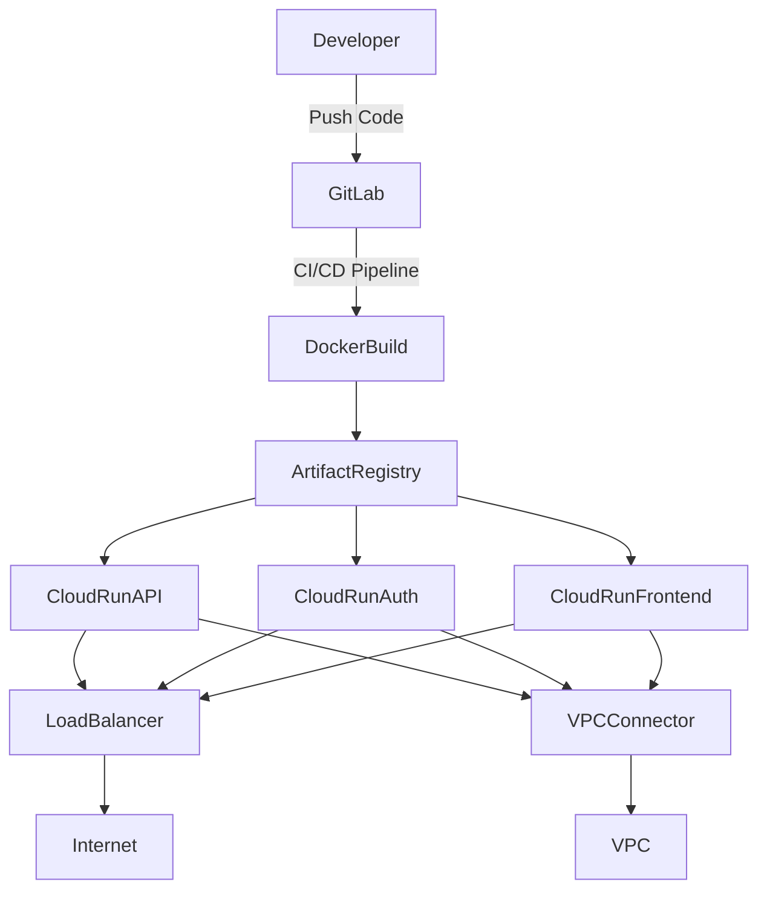
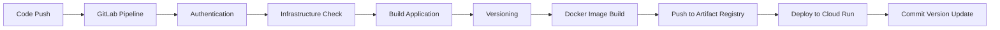
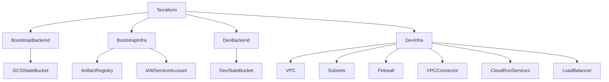

# Automated Cloud Run Deployment with Terraform and GitLab CI/CD

## Overview

This project demonstrates a fully automated CI/CD pipeline for deploying containerized microservices to **Google Cloud Run** using **Terraform** and **GitLab CI/CD**.

The infrastructure is provisioned using **Infrastructure as Code (Terraform)**, while each service is independently built, versioned, containerized, and deployed through GitLab pipelines.

The goal of this project is to showcase a complete DevOps workflow including:

* Infrastructure provisioning
* CI/CD automation
* Containerized microservices
* Cloud Run deployment
* Load balancing and networking

---

## Tech Stack

* **Google Cloud Platform**

  * Cloud Run
  * Artifact Registry
  * VPC
  * Serverless VPC Connector
  * HTTP Load Balancer
* **Terraform** (Infrastructure as Code)
* **GitLab CI/CD**
* **Docker**
* **Python** (microservices)

---

## Architecture

The system consists of three microservices:

* **API**
* **Auth**
* **Frontend**

Each service is independently built and deployed to **Cloud Run**.

Infrastructure is deployed in two stages:

1. **Bootstrap Infrastructure**

   * Artifact Registries
   * Service Account for infrastructure deployment

2. **Environment Infrastructure (Dev)**

   * VPC
   * Serverless VPC Connector
   * Cloud Run Services
   * HTTP Load Balancer

GitLab CI pipelines automate the entire lifecycle including infrastructure provisioning, image building, versioning, and deployment.

---

## Project Structure

```
project-root
│
├── services
│   ├── api
│   ├── auth
│   └── frontend
│
├── terraform
│   ├── bootstrap_backend
│   ├── bootstrap
│   ├── dev_backend
│   ├── environments
│   │   └── dev
│   └── modules
│
└── .gitlab-ci.yml
```

---

## Services Module

The **services** directory contains three independent microservices:

* API
* Auth
* Frontend

Each service includes:

* `app.py` – Python application
* `Dockerfile` – Container build configuration
* `.gitlab-ci.yml` – Service-specific pipeline

### Service Pipeline Stages

Each service pipeline contains the following stages:

1. **authentication** – Authenticate with Google Cloud.
2. **infra_check** – Ensure required infrastructure exists.
3. **build** – Build the application.
4. **versioning** – Generate an independent version for the service.
5. **docker_build** – Build the Docker image.
6. **deploy** – Deploy the container to Cloud Run.
7. **version_commit** – Commit the updated version.

Each service maintains **independent versioning**.

---

## Terraform Infrastructure

The **terraform** module contains the Infrastructure as Code for provisioning all required cloud resources.

### Terraform Pipelines

The Terraform GitLab pipeline includes the following stages:

* bootstrap_backend_deploy
* bootstrap_infra_deploy
* dev_backend_deploy
* dev_infra_deploy
* dev_infra_destroy
* bootstrap_infra_destroy
* dev_backend_destroy
* bootstrap_backend_destroy

These stages handle creation and destruction of both bootstrap and development infrastructure.

---

## Terraform Components

### Backend State Storage

* **bootstrap_backend** – Creates a GCS bucket for storing bootstrap Terraform state
* **dev_backend** – Creates a GCS bucket for storing development Terraform state

These backends ensure Terraform state is stored securely and remotely.

---

### Bootstrap Infrastructure

The **bootstrap** module deploys:

* Artifact Registries (one for each service)
* Service account for infrastructure deployment

The service account is configured with **least-privilege IAM roles** required to deploy the development infrastructure.

---

### Development Infrastructure

Located in:

```
terraform/environments/dev
```

This layer deploys:

* VPC network
* Workload subnets
* Proxy-only subnet
* Firewall rules
* Serverless VPC Connector
* Cloud Run services
* HTTP Load Balancer

---

## Terraform Modules

Reusable Terraform modules are stored in the `modules` directory.

### artifact_registry

Creates three Artifact Registries used for storing Docker images of the services.

### iam

Creates a service account and assigns least-privilege roles required for infrastructure deployment.

### vpc

Creates:

* VPC network
* Workload subnets
* Proxy-only subnet
* Firewall rules

### vpc_connector

Deploys a **Serverless VPC Connector** to connect Cloud Run services to the VPC.

### cloudrun_service

Creates three Cloud Run services using a placeholder container image.

### load_balancer

Configures an HTTP Load Balancer that routes traffic to the Cloud Run services.

Resources created include:

* Network Endpoint Groups (NEGs)
* Backend services
* URL map
* HTTP proxy
* Forwarding rule
* Reserved IP address

---

## Root CI/CD Pipeline

The root `.gitlab-ci.yml` orchestrates the deployment workflow.

### Pipeline Stages

* **infra** – Deploy infrastructure
* **api** – Deploy API service
* **auth** – Deploy Auth service
* **frontend** – Deploy Frontend service

Child pipelines are triggered dynamically using rules based on the variable:

```
PIPELINE_TARGET
```

Example rule:

```
rules:
  - if: '$PIPELINE_TARGET == "infra"'
  - when: never
```

This allows selective pipeline execution depending on the deployment target.

---

## Key Features

* Fully automated infrastructure provisioning
* Modular Terraform architecture
* Bootstrap + environment infrastructure separation
* Independent microservice deployment
* Automated Docker image builds
* Service versioning
* GitLab CI/CD pipeline orchestration
* Serverless deployment using Google Cloud Run
* Load-balanced microservice architecture

---

## Architecture Diagram



---

## CI/CD Pipeline Flow



---

## Infrastructure Provisioning Flow



---

## Purpose of the Project

This project was created to demonstrate a **production-style DevOps workflow** including:

* Infrastructure as Code
* CI/CD automation
* Containerized services
* Cloud-native deployment
* Scalable microservice architecture

It can serve as a reference implementation for deploying microservices to **Google Cloud Run using Terraform and GitLab CI/CD**.
